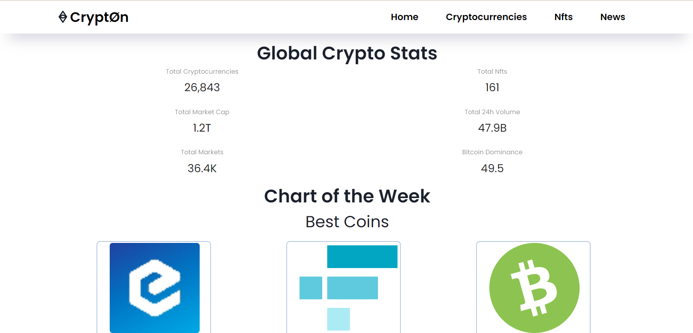
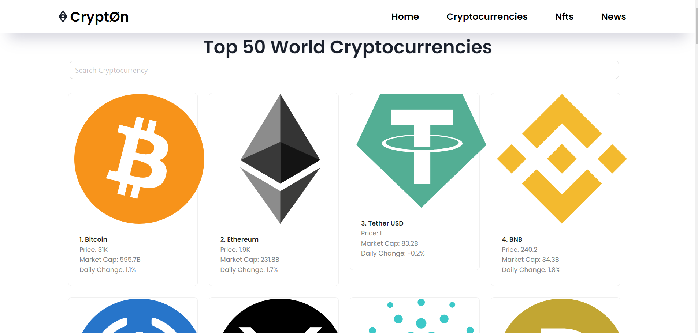
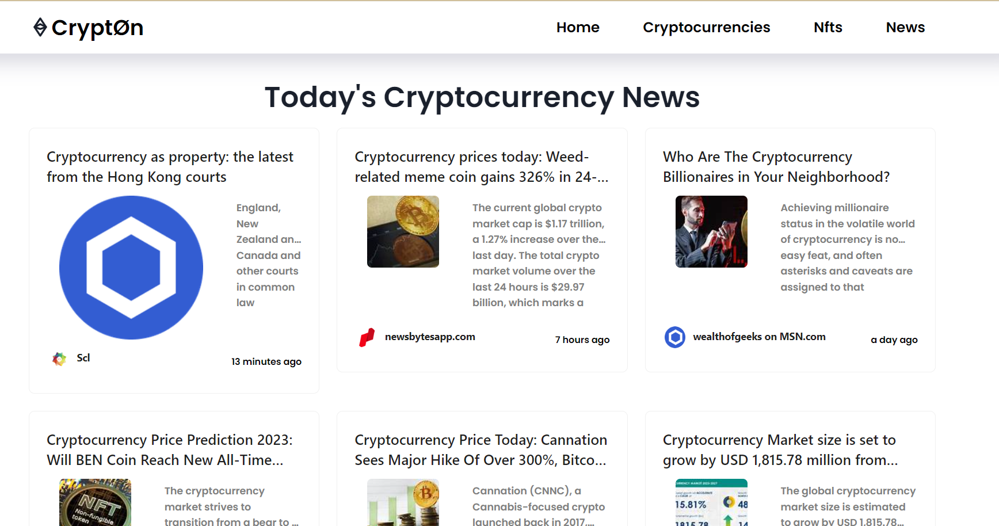
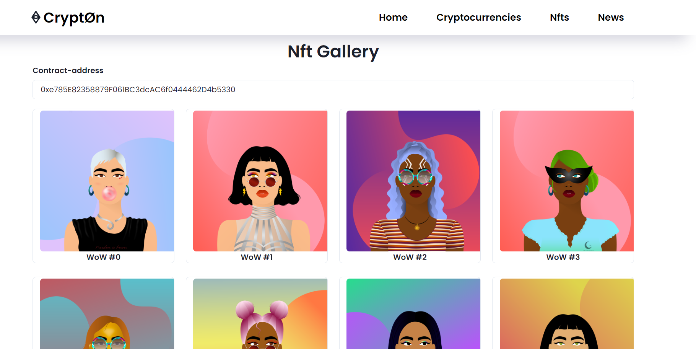
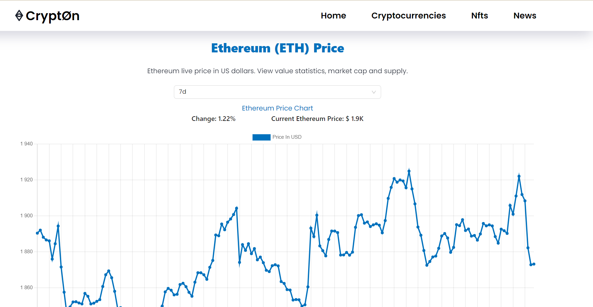

# HELLO WORLD! :earth_africa:
**********
**SoftTeco Test Task**💟

Main stack of this application: *JavaScript, React.JS, Antd, Chakra-UI, HTML, CSS*:stuck_out_tongue:

This is my *vision* for the implementation of the *creation of a web application displaying all information about cryptocurrencies.

**Task**

Сreate an application for processing api with the collection of news, statistics and information about cryptocurrencies. Primary requirements:
1. Adaptability of all components
2. Working search menu
3. The ability to view statistics for each coin(With different time periods) using a graph
4. Receiving nfts from different contract and collection
5. Routing
6. Pleasant design
**********
**User guide**:paperclip:
1. Download zip-archive with code and open it in *VSCode/WebStorm*.
2. Change directory in console to first/second version
   `cd SoftTeco-Project`
3. In console write next command to install all dependencies and modules for our project.
   `npm install`
4. Then in console write next command to start program in live server.
   `npm start`
5. In browser search bar type next text `http://localhost:3000/` or it will open automatically
6. Enjoy it!
**********
**How does it look like**:eyes:

*Screen of Home Page*

*Screen of Cryptocurrencies Page*

*Screen of News Page*

*Screen of Nfts Page*

*Screen of Statistic Page*

**********
I just relax and gained experience here.

Still in progress? Convert to draft!:wink:

>Work it harder, make it better. Do it faster, makes us stronger. More than ever, hour after hour. 
Work is never over :microphone:Daft Punk — Harder, Better, Faster, Stronger
